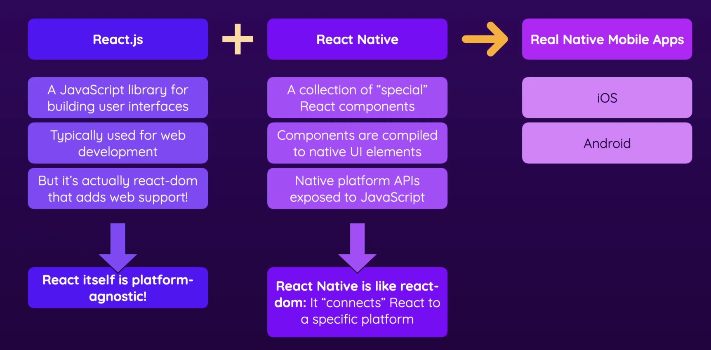

### Installing & Configuration

React-Native primarily using JavaScript to compile the code & run on various devices, making it cross-functional technology . Pre-Requisites are following softwares `Android Studio, Visual Studio Code, Git, Node.js, JDK ` . Check for the versions compatible with latest React-Native support . Add `local.properties file` inside android folder, add path `sdk.dir=C\:\\Users\\UserName\\AppData\\Local\\Android\\SDK`. Install the react-native project using command `npx react-native init ProjectName .`  Run your application using `npx react-native start.`

Folder structure includes **__ test __**  folder `used by the tester to write test cases for the application`, **.bundle** folder  `contains .config file, which we don't need to touch `, **android** folder ` resposible for storing android specific files & folders`, **ios** folder & **node modules.**  App registry file is responsible for converting one file into android & ios.



### React-Native Under the Hood

We write our logic in JSX, then, program is compiled into Real Native Application, but, actually components such as `<SafeAreaView, View, Text> are getting compiled into `  an Application. We can say, View is similar to `<div> tag` in Web-Browser. Logic written in JavaScript is not compiled, but, runned on a JS thread hosted by React-Native.  We work on using core & built-in components provided by React Native, to combine with our functional code to create custom components. Styling can be done using Inline Styles or StyleSheet Objects. There is a subset of CSS properties & features that are supported.

View by-default organize his childrens using flex-box. *JustifyContent* works on the main axis set using *FlexDirection &* *AlignItems* works on the cross-axis. Scroll View puts unnecessary load of renndering the entire list, thus, FlatList is a better choice. 

```javascript
<ScrollView style={styles.goalsContainer}>
    {courseGoals.map((goal) => (
    <View key={goal} style={styles.goalCardContainer}>
    	<Text style={styles.goalCardText}> {goal} </Text>
    </View>
))}
</ScrollView>
```

## React Basics

```javascript
/* 
 * Props are resuable components or basically functions attached to our react-application, In simple words, it is parameter 
 * Also, when you do dynamic listing, provide key={item.id} as prop to the TodoItem
*/

import React from "react";
interface TodoItemProps {
	title: string;
	color?: string;
}
const TodoItem: React.FC<TodoItemProps> = (props) => {
return
	<div>
		<li> Props in use </li>
		<li> { props.title } </li>
	</div>
};
export default TodoItem;
-----------------------------------------

<TodoItem title="This is custom title" />
```
